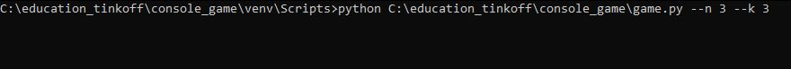
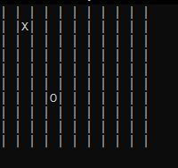
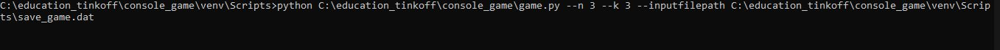

# Start application
To start the application, the user needs to type: python "the path of the script" and enter mandatory parameters - the dimensions of the playing field in the format: --n {number of rows} --k {number of columns} in the command line (cmd).

For example: 

Player can choose a symbol: zero or cross.

Player must enter the cell coordinates separated by a one blank space, where to put zero or cross. 

Value coordinates must be less than the field size (N and K, respectively).

# Short rules of Noughts and Сrosses

Noughts and crosses is a game for two players who take turns marking the spaces in a grid with X or O. The player who succeeds in placing min(N, K) of their marks in a horizontal, vertical, or diagonal row is the winner. It is a solved game, with a forced draw assuming best play from both players.

Player and computer move sequentially in the game.

Game process: 

The victory condition is min (N,K) consecutive crosses / zeroes horizontally, vertically or diagonally.

# Game features 

Player can save the game by entering "s" in the command line.

Player can load a saved game by entering the input file path at start up.

For example :

# Requirements

You must have either Python 3.5+ to run the game.

External Python Libraries Used

+ curses

+ enum

+ random

+ typer

+ pickle
